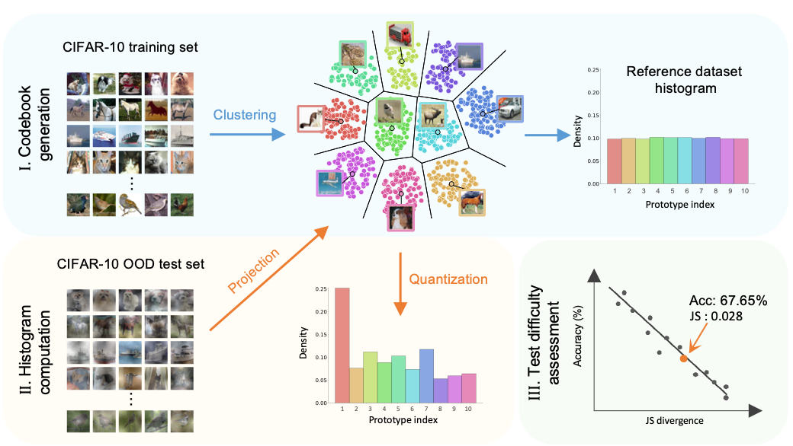

# Bag-of-Prototypes

This codebase provides an official implementation for the paper: [A Bag-of-Prototypes Representation for Dataset-Level Applications](https://arxiv.org/abs/2303.13251) at CVPR 2023.

### Abstract
This work investigates dataset vectorization for two dataset-level tasks: assessing training set suitability and test set difficulty. The former measures how suitable a training set is for a target domain, while the latter studies how challenging a test set is for a learned model. Central to the two tasks is measuring the underlying relationship between datasets. This needs a desirable dataset vectorization scheme, which should preserve as much discriminative dataset information as possible so that the distance between the resulting dataset vectors can reflect dataset-to-dataset similarity. To this end, we propose a bag-of-prototypes (BoP) dataset representation that extends the image-level bag consisting of patch descriptors to dataset-level bag consisting of semantic prototypes. Specifically, we develop a codebook consisting of K prototypes clustered from a reference dataset. Given a dataset to be encoded, we quantize each of its image features to a certain prototype in the codebook and obtain a K-dimensional histogram. Without assuming access to dataset labels, the BoP representation provides rich characterization of the dataset semantic distribution. Furthermore, BoP representations cooperate well with Jensen-Shannon divergence for measuring dataset-to-dataset similarity. Although very simple, BoP consistently shows its advantage over existing representations on a series of benchmarks for two dataset-level tasks.

<figure class="image">
  <p align="center">
    
  </p>
</figure>

## PyTorch Implementation

### Note

The current implementation of K-Means is from scikit-learn. To speed up the construction of codebook, [torch-kmeans](https://pypi.org/project/torch-kmeans/) can be used.

This repository contains:

- the Python implementation of BoP.
- the example on CIFAR-10 setup

Please follow the instruction below to install it and run the experiment demo.

### Prerequisites
* Please install Numpy and scikit-learn
* [CIFAR-10](https://www.cs.toronto.edu/~kriz/cifar.html) (download and unzip to ```PROJECT_DIR/data/```)
* [CIFAR10.1](https://github.com/modestyachts/CIFAR-10.1) (download and unzip to ```PROJECT_DIR/data/CIFAR-10.1```)
* You might need to change the file paths, and please be sure you change the corresponding paths in the codes as well 

## Getting started
0. Load extracted image features
```python
   import numpy as np
   # Load image features of the reference dataset
   # It should be of size (n, d), n is the number of images, and d is the feature dimension
   ref_feature = np.load('/path/to/features/cifar10_train.npy')
   
   # Load image features of the target dataset
   target_feature = np.load('/path/to/features/target.npy')
```

1. Generate the codebook
```python
   from BoP import BoP
   # Generate the codebook based on the reference dataset
   codebook = BoP(ref_data=ref_feature, n_prototype=80, cache_path='/path/to/save/')
```

2. Evaluate
```python
   # Encode the target dataset and measure the distance
   results = codebook.evaluate(target_feature)
   
   print(f'The BoP of encoded dataset is {results['BoP']}')
   print(f'The distance is {results['JS']}')
```

## Citation
 ```bibtex
@inproceedings{tu2023bop,
  title={A Bag-of-Prototypes Representation for Dataset-Level Applications},
  author={Tu, Weijie and Deng, Weijian and Gedeon, Tom and Liang, Zheng},
  booktitle={Proceedings of the IEEE/CVF Conference on Computer Vision and Pattern Recognition},
  year={2023}
}
```


## License
MIT
